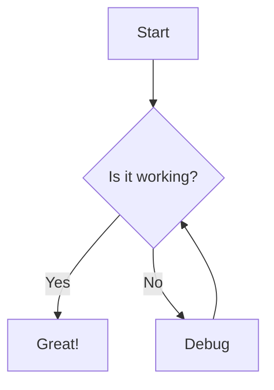

import BlogContentImage from '/src/components/BlogContentImage.astro';

**Astro 5.5 dives deep with better support for diagramming tools, improved Markdown compatibility, and type-safe sessions!**

🧜‍♀️ Dive into a sea of new features with these improvements to Astro:

- [**Better support for diagramming tools in Markdown**](#better-support-for-diagramming-tools-in-markdown)
- [**Type-safe experimental sessions**](#type-safe-experimental-sessions)
- [**Improved heading ID compatibility**](#improved-heading-id-compatibility)

To upgrade an existing project, use the automated `@astrojs/upgrade` CLI tool. Alternatively, upgrade manually by running the upgrade command for your package manager:

```sh
# Recommended:
npx @astrojs/upgrade

# Manual:
npm install astro@latest
pnpm upgrade astro --latest
yarn upgrade astro --latest
```

## Better support for diagramming tools in Markdown

Tools like Mermaid and D2 let you define charts and diagrams in code blocks in Markdown, which are then rendered inside the content. Until now, using these in Astro could be tricky, because Astro's default syntax highlighting would interfere with how the code blocks were rendered.

Astro 5.5 introduces a new `excludeLangs` option in your Markdown configuration that makes it possible to skip syntax highlighting for specific language code blocks. This unlocks the ability to use tools like these without disabling syntax highlighting for other blocks.

Here's an example of how to configure Astro to disable highlighting for the `mermaid` language after installing the [`rehype-mermaid` plugin](https://github.com/remcohaszing/rehype-mermaid):

```js title="astro.config.mjs"
import { defineConfig } from 'astro/config';
import rehypeMermaid from 'rehype-mermaid';

export default defineConfig({
	markdown: {
		syntaxHighlight: {
			type: 'shiki',
			excludeLangs: ['mermaid', 'math'],
		},
		rehypePlugins: [rehypeMermaid],
	},
});
```

Then, you can create diagrams directly in your Markdown content:

````md

````

This will then render as a diagram in your page.

Massive thanks to [Chris Chua](https://github.com/chrisirhc) for this contribution.

## Type-safe experimental sessions

Astro 5.5 adds support for proper TypeScript typing for your session data, letting you banish `any` mistakes. Experimental support for session storage was added in Astro 5.1, but previously all session data was untyped. Now you can define the types of your session data by extending the global `App.SessionData` interface in your project's `src/env.d.ts` file:

```ts title="src/env.d.ts"
declare namespace App {
	interface SessionData {
		user: {
			id: string;
			email: string;
		};
		lastLogin: Date;
	}
}
```

This is optional, and any keys not defined in this interface will be treated as `any`. However, defining the types will provide accurate type checking and autocomplete when working with session data in your site:

```astro
---
const user = await Astro.session.get('user');
// `user` is properly typed as `{ id: string; email: string; } | undefined`

const something = await Astro.session.get('something');
// `something` is typed as `any` since it's not defined in the interface

// TypeScript will catch this error:
Astro.session.set('user', 1); // Error: Type 'number' is not assignable to type '{ id: string; email: string; }'
---
```

This improvement makes working with sessions in Astro more reliable and helps catch potential errors at development time rather than at runtime.

For more information, see the [experimental sessions docs](https://docs.astro.build/en/reference/experimental-flags/sessions/#session-data-types).

## Improved heading ID compatibility

Astro 5.5 introduces a new [`experimental.headingIdCompat`](https://docs.astro.build/en/reference/experimental-flags/heading-id-compat/) flag that generates heading IDs consistent with other common Markdown processors like those used by GitHub and npm.

By default, Astro removes trailing dashes from the end of IDs it generates for headings containing special characters. This behavior differs from other common Markdown processors, which can cause inconsistencies when linking to headings across different platforms.

With the new configuration flag, you can now ensure your heading IDs follow the same convention as other platforms:

```js title="astro.config.mjs"
import { defineConfig } from 'astro/config';

export default defineConfig({
	experimental: {
		headingIdCompat: true,
	},
});
```

This is particularly useful for sites that might have anchor links shared between GitHub, npm documentation, and your Astro website.

## Bug fixes

As always, we've been working hard on fixing issues since the [5.4 release](/blog/astro-540). See [the changelog](https://github.com/withastro/astro/blob/main/packages/astro/CHANGELOG.md) for all the details.

## Thanks

Thanks to everyone who contributed to this release, including [Chris Swithinbank](https://github.com/delucis), [Emanuele Stoppa](https://github.com/ematipico), [Luiz Ferraz](https://github.com/Fryuni), [Sarah Rainsberger](https://github.com/sarah11918), [HiDeoo](https://github.com/HiDeoo), [Yan Thomas](https://github.com/yanthomasdev), [Chris Chua](https://github.com/chrisirhc), and many more.

We look forward to seeing what you build with Astro 5.5! If you have questions, comments, or just want to say hi, drop by the [Astro Discord](https://astro.build/chat).

import RelatedPosts from './_components/RelatedPosts.astro';

<RelatedPosts slugs={['astro-540', 'astro-530']} />
